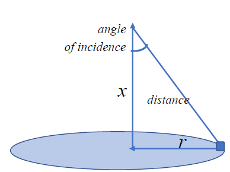

# Задача 1

Постройте график функции и её производных $F=(x-5)^2+6x$. Найдите минимум функции. $\frac{dF}{dx}=2(x-5)+6$.

```{r}
library(plotly) 

F <- function(x){
  (x - 5) ^ 2 + 6 * x
}

dF <- function(x){
  2 * (x - 5) + 6
}

x <- seq(-5, 10, by = 0.1)
y <- F(x)
dy <- dF(x)
data <- data.frame(x, y)
Ddata <- data.frame(x, dy)
fig <- plot_ly(data, x = ~x, y = ~y,type = 'scatter', mode = 'lines') |>
  add_trace(Ddata, x = ~x, y = ~dy,type = 'scatter', mode = 'lines')

fig
```

```{r}
op <- optimise(F, c(-5, 10))
x_min = op$minimum
cat(x_min, "\n")
cat(F(x_min))
```

Minimum in x=`r x_min`. Function minimum $F_{min}=$ `r F(x_min)`

# Задача 2

Лампа висит над центром круглого стола радиуса $r$. Освещение прямо пропорционально косинусу угла падения световых лучей и обратно пропорционально квадрату расстояния до источника света. На какой высоте лампы над столом $x$ освещение предмета, лежащего на краю стола, будет наилучшим? Пусть $r=1 м.$ Постройте график зависимости освещенности от высоты подвеса светильника. Найдите производную этой функции и постройте ее график. .  $F=\frac{cos(a)}{r^2+x^2}=[cos(a)=\frac{x}{\sqrt{r^2+x^2}}]=\frac{x}{(r^2+x^2)(\sqrt{r^2+x^2})}$, $\frac{dF}{dx}=\frac{r^2-2x^2}{(r^2 + x^2)^{5 / 2}}$.

```{r}
library(plotly) 

F <- function(x, r = 1){
  cos_value <- x / sqrt(x^2 + r^2)
  cos_value / (x^2 + r^2)
}

dF <- function(x, r = 1){
  (r^2 -2 * x^2) / (r^2 + x^2) ^ (5 / 2)
}

r <- c(1)
x <- seq(0, 5, length.out = 5000)
y <- F(x, r)
dy <- dF(x, r)

data <- data.frame(x, y)
dData <- data.frame(x, dy)

fig <- plot_ly(data, x = ~x, y = ~y,type = 'scatter', mode = 'lines') |> 
  add_trace(Ddata, x = ~x, y = ~dy, type = 'scatter', mode = 'lines')

fig
```

```{r}
op <- optimise(F, c(0, 5), maximum = T)
cat(op$maximum, "\n")
cat(F(op$maximum))
```

$\\F_{max}=$ `r op$maximum` in $x =$ `r F(op$maximum)`

# Задача 3

Постройте объемный и контурный график функции $F=3x^2+xy+2y^2-x-4y$. Найдите частные производные. Определите точки максимума, минимума и перегиба. $\frac{dF}{dx}=6x+y-1$, $\frac{dF}{dy}=x+4y-4$.

```{r}
library(plotly) 

F <- function(x, y){
  3 * x^2 + x * y + 2 * y ^ 2 - x - 4 * y
}

x <- y <- seq(-5, 5, length.out = 100)
z <-t(outer(x, y, FUN = F))
plot_ly(z = ~z) |> add_surface()
```

```{r}

z <- t(outer(x, y, FUN = F))
plot_ly(x = ~x, y = ~y, z = ~z, type = "contour")
```

```{r}
library(plotly) 

solution <- optim(c(0, 0), function(vec) F(vec[1], vec[2]))
min_point <- solution$par
min_point
cat(F(min_point[1], min_point[2]))
```

$MaxSpots=$ `r min_point[1]` , `r min_point[2]`, $F_{min}$ = `r F(min_point[1], min_point[2])`.

# Задача 4

Найдите частные производные функции $F=xy$ и точку, где они равны 0. Постройте объемный и контурный график. Какие особые точки вы можете выделить. $\frac{dF}{dx}=y\\$, $\frac{dF}{dy}=x\\$.

```{r}
F <- function(x, y){
  x * y
}

x <- y <- seq(-5, 5, length.out = 100)
z <- t(outer(x, y, FUN = F))
plot_ly(z = ~z) |> add_surface()
```

```{r}
z <- t(outer(x, y, FUN = F))
plot_ly(x = ~x, y = ~y, z = ~z, type = "contour")
```

```{r}
solution <- optim(c(0, 0), function(vec) F(vec[1], vec[2]))
min_point <- solution$par
```

```{r}
cat(min_point, "\n")
cat(F(min_point[1], min_point[2]))
```

$x_{optimum}=$ `r min_point[1]`, $y_{optimum}=$ `r min_point[2]`, $F_{optimum}=$ `r F(min_point[1], min_point[2])`
