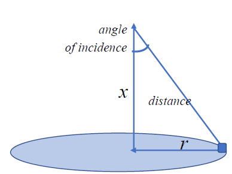

# Lab1

##

### [Task 1](/Lab1/README.md#task-1)
### [Task 2](/Lab1/README.md#task-2)
### [Task 3](/Lab1/README.md#task-3)
### [Task 4](/Lab1/README.md#task-4)

##

## Full Report

The .rmd file is available [here](/Lab1/Lab1Task.Rmd).

## Task 1

Plot the function and its derivatives $F=(x-5)^2+6x$. Find the minimum of the function. $\frac{dF}{dx}=2(x-5)+6$.

The R script for the solution is available [here](/Lab1/lab1_1.R).

## Task 2

A lamp is hanging above the center of a circular table with a radius of $r$. Illumination is directly proportional to the cosine of the angle of incidence of the light rays and inversely proportional to the square of the distance to the light source. At what height $x$ above the table will the illumination of an object lying on the edge of the table be optimal? Let $r=1 m$. Plot the dependence of brightness on the height of the lamp suspension. Find the derivative of this function and plot its graph.  $F=\frac{\cos(a)}{r^2+x^2}=[\cos(a)=\frac{x}{\sqrt{r^2+x^2}}]=\frac{x}{(r^2+x^2)(\sqrt{r^2+x^2})}$, $\frac{dF}{dx}=\frac{r^2-2x^2}{(r^2 + x^2)^{5 / 2}}$.

The R script for the solution is available [here](/Lab1/lab1_2.R).

## Task 3

Plot the three-dimensional and contour graph of the function $F=3x^2+xy+2y^2-x-4y$. Find the partial derivatives. Determine the points of maximum, minimum, and inflection. $\frac{dF}{dx}=6x+y-1$, $\frac{dF}{dy}=x+4y-4$.

The R script for the solution is available [here](/Lab1/lab1_3.R).

## Task 4

Find the partial derivatives of the function $F=xy$ and the point where they are equal to 0. Plot the three-dimensional and contour graph. Identify any special points. $\frac{dF}{dx}=y\\$, $\frac{dF}{dy}=x\\$.

The R script for the solution is available [here](/Lab1/lab1_4.R).