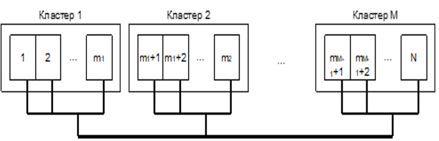

# Задание

Найти размещение данных по вычислительным станциям в распределённой вычислительной сети на основе кластеров (см. Рисунок 1).
Провести анализ ограничений.



В глобальной компьютерной сети сформирована распределенная вычислительная среда, состоящая из $N$ высокопроизводительных рабочих станций, объединенных в $M$ групп (кластеров).
Данные для обработки однородны и трудоемкость расчетов зависит только от их объема.
Данные независимы и их отдельные массивы могут обрабатываться совершенно независимо.
Известно время обработки 1 Мб данных на каждой рабочей станции $q_i$.
Необходимо найти оптимальное распределение заданного объема данных для обработки на станциях.
Так как рабочие станции должны использоваться и для решения других (локальных) задач необходимо минимизировать общее время загрузки всех рабочих станций.
Желательно, чтобы результаты обработки от разных кластеров поступали одновременно.
Кроме того, владельцами кластеров могут ограничиваться как объемы информации, обрабатываемой их кластерами, так и объемы, обрабатываемые отдельными рабочими станциями.
Множество возможных альтернатив определяется объемом данных $s_i$, направляемых для обработки на $i$-ю станцию.

Варьируемые параметры -- вектор значений объема данных, направляемого для обработки на каждую станцию.
Фиксированные независимые параметры -- времена обработки $a_i$, 1 Мб данных $i$-й станцией, предельно допустимые объемы информации, которые могут быть обработаны $i$-й станцией $P_i$, $i=1,2,...,N$ и $j$-м кластером $R_j$, $j=1,2,...,M$; объем данных, подлежащий обработке $X$.

Цель - минимизация суммарного времени загрузки всех станций.

Ограничения: суммарный объем обрабатываемых данных равен $X$, объем данных, обрабатываемый каждой $i$-й станцией больше или равен 0, но меньше или равен $P_i$, объем данных, обрабатываемый каждым $j$-м кластером меньше или равен $R_j$; времена обработки данных кластерами равны.

Таким образом, линейную модель можно записать как минимизацию общего времени обработки данных в системе

$$\min{F(\vec{x})}=\sum_{i=1}^{N} q_ix_i$$

при условии равенства фактического объёма обрабатываемых рабочими станциями данных требуемому: $$\sum_{i=1}^{N} x_i=X$$ при условии, что нагрузка на каждую станцию находится в допустимом диапазоне: $$x_i\geq0,x_i\leq P_i, i=1,2,...,N$$ при условии, что общий объём данных, обрабатываемый кластером, не превышает установленной величины: $$\sum_{i=1}^{m_1} x_i\leq R_1, \sum_{i=m_1+1}^{m_2} x_i\leq R_2, \sum_{i=m_{M-1}+1}^{N} x_i\leq R_M$$ при условии равенства времён обработки на всех кластерах: $$\sum_{i=1}^{m_1} x_i =\sum_{i=m_1+1}^{m_2} x_i, \sum_{i=m_2+1}^{m_3} x_i =\sum_{i=1}^{m_1} x_i, \sum_{i=m_{M-1}+1}^{N} x_i =\sum_{i=1}^{m_1} x_i$$

**Замечание**: это условие вынуждает использовать искусственное начальное решение, и, как следствие, применять для решения задачи M-метод или двухэтапный метод.
По этой причине изначально оно рассматриваться не будет, и будет введено лишь при изучении искусственного начального решения.

# Пример

Запишем исходные данные для решения конкретной задачи размещения данных:

-   Количество кластеров $M=3$
-   Количество рабочих станций $N=10$
-   В первом кластере 4 станции, во втором -- 2, в третьем -- 4, т.е. $m_1=4$, $m_2=6$, $m_3=10$
-   Время обработки данных станциями $q_1=10$, $q_2=4$, $q_3=8$, $q_4=6$, $q_5=2$, $q_6=3$, $q_7=8$, $q_8=2$, $q_9=6$, $q_10=6$
-   Ограничения на объём данных, обрабатываемых каждой станцией: $P_1=700$, $P_2=700$, $P_3=700$, $P_4=700$, $P_5=700$, $P_6=700$, $P_7=700$, $P_8=700$, $P_9=700$, $P_10=700$
-   Ограничения на объём данных, обрабатываемых каждым кластером: $R_1=400$, $R_2=800$, $R_3=600$ Общий объём обрабатываемых данных $1000$ Мб.
-   Время обработки должно совпадать.

$$\begin{cases}
          \min{F(x)=10x_1+4x_2+8x_3+6x_4+2x_5+3x_6+8x_7+2x_8+6x_9+6x_{10}}\\
          x_1+x_2+x_3+x_4\leq400\\
          x_5+x_6\leq800\\
          x_7+x_8+x_9+x_{10}\leq600\\
          \sum_{i=1}^{10} x_i=1000\\
          10x_1+4x_2+8x_3+6x_4-2x_5-3x_6=0\\
          10x_1+4x_2+8x_3+6x_4-8x_7-2x_8-6x_9-6x_{10}=0\\
          \forall{i}: 0\leq x_i\leq700
  \end{cases}\,$$

# Варианты

## Вариант 1

$$\begin{cases}
      \min{F(x)=10x_1+4x_2+8x_3+6x_4+2x_5+3x_6+8x_7+2x_8+6x_9+6x_{10}}\\
      x_1+x_2+x_3+x_4\leq400\\
      x_5+x_6\leq800\\
      x_7+x_8+x_9+x_{10}\leq600\\
      \sum_{i=1}^{10} x_i=1000\\
      10x_1+4x_2+8x_3+6x_4-2x_5-3x_6=0\\
      x_1+x_2+x_3+x_4+x_7+x_8+x_9+x_{10}\geq700\\
      \forall{i}: 0\leq x_i\leq700
\end{cases}\,$$

```{r}
library(lpSolve)

# Coefficients from min F(x)
Fun <- c(10, 4, 8, 6, 2, 3, 8, 2, 6, 6)

# Boarders (coefficients near limitations)
A <- rbind(c(1, 1, 1, 1, 0, 0, 0, 0, 0, 0), # 1'st claster
           c(0, 0, 0, 0, 1, 1, 0, 0, 0, 0), # 2'nd claster
           c(0, 0, 0, 0, 0, 0, 1, 1, 1, 1), # 3'th claster
           c(1, 1, 1, 1, 1, 1, 1, 1, 1, 1), # total sum = 1000
           c(10, 4, 8, 6, -2, -3, 0, 0, 0, 0), # сriterion of simultaneous completion of work
           c(1, 1, 1, 1, 1, 1, 1, 1, 1, 1), # sum data proceeding >= 700
           c(1, 0, 0, 0, 0, 0, 0, 0, 0, 0), # x1 <= 700
           c(0, 1, 0, 0, 0, 0, 0, 0, 0, 0), # x2 >= 700
           c(0, 0, 1, 0, 0, 0, 0, 0, 0, 0), # x3 >= 700
           c(0, 0, 0, 1, 0, 0, 0, 0, 0, 0), # x4 >= 700
           c(0, 0, 0, 0, 1, 0, 0, 0, 0, 0), # x5 <= 700
           c(0, 0, 0, 0, 0, 1, 0, 0, 0, 0), # x6 <= 700
           c(0, 0, 0, 0, 0, 0, 1, 0, 0, 0), # x7 <= 700
           c(0, 0, 0, 0, 0, 0, 0, 1, 0, 0), # x8 <= 700
           c(0, 0, 0, 0, 0, 0, 0, 0, 1, 0), # x9 <= 700
           c(0, 0, 0, 0, 0, 0, 0, 0, 0, 1)) # x10 <= 700

# The right sides

B <- c(400, 800, 600, 1000, 0, 700,
       700, 700, 700, 700, 700, 700, 700, 700, 700, 700)

# Signs

CD <- c("<=", "<=", "<=", "=", "=", ">=",
        "<=", "<=", "<=", "<=", "<=", "<=", "<=", "<=", "<=", "<=")

optimum <- lp(
  direction = "max",
  objective.in = Fun,
  const.mat = A,
  const.dir = CD,
  const.rhs = B,
  compute.sens = TRUE)
optimum
```

```{r}
optimum$solution
```

```{r}
library(lpSolveAPI)

# Create function with 10 features & 0 limitations
lprob <- make.lp(0, 10)

# Try to maximize resualt
stub <- lp.control(lprob, sense = "max")
rm(stub)

add.constraint(lprob, c(1, 1, 1, 1, 0, 0, 0, 0, 0, 0), "<=", 400)
add.constraint(lprob, c(0, 0, 0, 0, 1, 1, 0, 0, 0, 0), "<=", 800)
add.constraint(lprob, c(0, 0, 0, 0, 0, 0, 1, 1, 1, 1), "<=", 600)
add.constraint(lprob, c(1, 1, 1, 1, 1, 1, 1, 1, 1, 1), "=", 1000)
add.constraint(lprob, c(10, 4, 8, 6, -2, -3, 0, 0, 0, 0), "=", 0)
add.constraint(lprob, c(1, 1, 1, 1, 1, 1, 1, 1, 1, 1), ">=", 700)
add.constraint(lprob, c(1, 0, 0, 0, 0, 0, 0, 0, 0, 0), "<=", 700)
add.constraint(lprob, c(0, 1, 0, 0, 0, 0, 0, 0, 0, 0), "<=", 700)
add.constraint(lprob, c(0, 0, 1, 0, 0, 0, 0, 0, 0, 0), "<=", 700)
add.constraint(lprob, c(0, 0, 0, 1, 0, 0, 0, 0, 0, 0), "<=", 700)
add.constraint(lprob, c(0, 0, 0, 0, 1, 0, 0, 0, 0, 0), "<=", 700)
add.constraint(lprob, c(0, 0, 0, 0, 0, 1, 0, 0, 0, 0), "<=", 700)
add.constraint(lprob, c(0, 0, 0, 0, 0, 0, 1, 0, 0, 0), "<=", 700)
add.constraint(lprob, c(0, 0, 0, 0, 0, 0, 0, 1, 0, 0), "<=", 700)
add.constraint(lprob, c(0, 0, 0, 0, 0, 0, 0, 0, 1, 0), "<=", 700)
add.constraint(lprob, c(0, 0, 0, 0, 0, 0, 0, 0, 0, 1), "<=", 700)
```

```{r}
set.objfn(lprob, c(10, 4, 8, 6, 2, 3, 8, 2, 6, 6))
lprob
```

```{r}
# Solve 
status_code <- solve(lprob)
get.objective(lprob)
```

```{r}
get.variables(lprob)
```

```{r}
# Sensitive
original_options <- options(digits = 3, scipen = 30)

sensitivity_results <- get.sensitivity.obj(lprob)

for (i in 1:length(sensitivity_results$objfrom)) {
  cat(paste("x", i, "\t| [", sensitivity_results$objfrom[i], ", ", sensitivity_results$objtill[i], "]\n", sep = ""))
}
```

```{r}
get.sensitivity.rhs(lprob)
```

```{r}
optimum$sens.coef.from
optimum$sens.coef.to
```

## Вариант 2

$$\begin{cases}
      \min{F(x)=10x_1+4x_2+8x_3+6x_4+2x_5+3x_6+8x_7+2x_8+6x_9+6x_{10}}\\
      x_1+x_2+x_3+x_4\leq400\\
      x_5+x_6\leq800\\
      x_7+x_8+x_9+x_{10}\leq600\\
      \sum_{i=1}^{10} x_i\geq1200\\
      \forall{i}: 0\leq x_i\leq700
\end{cases}\,$$

## Вариант 3

$$\begin{cases}
      \min{F(x)=10x_1+4x_2+8x_3+6x_4+2x_5+3x_6+8x_7+2x_8+6x_9+6x_{10}}\\
      x_1+x_2+x_3+x_4\leq400\\
      x_5+x_6\leq800\\
      x_7+x_8+x_9+x_{10}\leq600\\
      \sum_{i=1}^{10} x_i=1200\\
      10x_1+4x_2+8x_3+6x_4-2x_5-3x_6=0\\
      x_1+x_2+x_3+x_4+x_5+x_6\geq700\\
      \forall{i}: 0\leq x_i\leq700
\end{cases}\,$$

## Вариант 4

$$\begin{cases}
      \min{F(x)=10x_1+4x_2+8x_3+6x_4+2x_5+3x_6+8x_7+2x_8+6x_9+6x_{10}}\\
      x_1+x_2+x_3+x_4\leq400\\
      x_5+x_6\leq800\\
      x_7+x_8+x_9+x_{10}\leq600\\
      \sum_{i=1}^{10} x_i=1200\\
      10x_1+4x_2+8x_3+6x_4-2x_5-3x_6=0\\
      10x_1+4x_2+8x_3+6x_4-8x_7-2x_8-6x_9-6x_{10}=0\\
      x_1+x_2+x_3+x_4+x_5+x_6\geq700\\
      \forall{i}: 0\leq x_i\leq700
\end{cases}\,$$

## Вариант 5

$$\begin{cases}
      \min{F(x)=10x_1+4x_2+8x_3+6x_4+2x_5+3x_6+8x_7+2x_8+6x_9+6x_{10}}\\
      x_1+x_2+x_3+x_4\leq400\\
      x_5+x_6\leq800\\
      x_7+x_8+x_9+x_{10}\leq600\\
      \sum_{i=1}^{10} x_i=1200\\
      \forall{i}: 0\leq x_i\leq700
\end{cases}\,$$

## Вариант 6

$$\begin{cases}
      \min{F(x)=10x_1+4x_2+8x_3+6x_4+2x_5+3x_6+8x_7+2x_8+6x_9+6x_{10}}\\
      x_1+x_2+x_3+x_4\leq400\\
      x_5+x_6\geq800\\
      x_7+x_8+x_9+x_{10}\leq600\\
      \sum_{i=1}^{10} x_i=1200\\
      \forall{i}: 0\leq x_i\leq700
\end{cases}\,$$

## Вариант 7

$$\begin{cases}
      \min{F(x)=10x_1+4x_2+8x_3+6x_4+2x_5+3x_6+8x_7+2x_8+6x_9+6x_{10}}\\
      x_1+x_2+x_3+x_4\leq400\\
      x_5+x_6\leq800\\
      x_7+x_8+x_9+x_{10}\geq600\\
      \sum_{i=1}^{10} x_i=1000\\
      \forall{i}: 0\leq x_i\leq700
\end{cases}\,$$

## Вариант 8

$$\begin{cases}
      \min{F(x)=10x_1+4x_2+8x_3+6x_4+2x_5+3x_6+8x_7+2x_8+6x_9+6x_{10}}\\
      x_1+x_2+x_3+x_4\leq400\\
      x_5+x_6\leq800\\
      x_7+x_8+x_9+x_{10}\leq600\\
      \sum_{i=1}^{10} x_i=1000\\
      10x_1+4x_2+8x_3+6x_4-2x_5-3x_6=0\\
      x_1+x_2+x_3+x_4+x_5+x_6\geq900\\
      \forall{i}: 0\leq x_i\leq700
\end{cases}\,$$

## Вариант 9

$$\begin{cases}
      \min{F(x)=10x_1+4x_2+8x_3+6x_4+2x_5+3x_6+8x_7+2x_8+6x_9+6x_{10}}\\
      x_1+x_2+x_3+x_4\leq400\\
      x_5+x_6\geq800\\
      x_7+x_8+x_9+x_{10}\leq600\\
      \sum_{i=1}^{10} x_i=1000\\
      \forall{i}: 0\leq x_i\leq700
\end{cases}\,$$

## Вариант 10

$$\begin{cases}
      \min{F(x)=10x_1+4x_2+8x_3+6x_4+2x_5+3x_6+8x_7+2x_8+6x_9+6x_{10}}\\
      x_1+x_2+x_3+x_4\leq400\\
      x_5+x_6\geq900\\
      x_7+x_8+x_9+x_{10}\leq600\\
      \sum_{i=1}^{10} x_i=1500\\
      \forall{i}: 0\leq x_i\leq700
\end{cases}\,$$

# Контрольные вопросы

-1. Чувствительность

### 

  Чувствительность коэффициентов целевой функции - то как изменение коэффициентов целевой функции повлияет на оптимальное значение
  Чувствительность ограничений - как изменения в правых частях ограничений влияют на оптимальное решение
  Диапазоны допустимых значений - в каких пределах должны изменяться коэффициенты или ограничения, чтобы сохранить оптимальное решение.
  
### 

0.  Симплекс метод

### 

Симплекс метод основан на переборе вершин многогранника, заданного системой ограничений задачи.
Он последовательно переходит от одной вершины (опорного плана) к другой, пока не найдет оптимальную вершину, где целевая функция достигает максимума/минимума.
На каждом шаге симплекс-метод выбирает вершину, в которой значение целевой функции может быть улучшено.
Используются линейные преобразования системы уравнений, чтобы упростить вычисления.

### 

1.  Что такое стандартная форма модели ЛП?

### 

Это задача поиска экстремумов для целевой функции, которая заданна как линейная функция от фич, признаков, иксов короче.
Ограничения так же являются линейной комбинацией признаков.

### 

2.  Чем отличаются условия допустимости и оптимальности для функций минимизации и максимизации?

### 

Условия допустимости лдинаковы и сводятся к заданию ограничений для переменных, или комбинации переменных.
Оптимальность для минимазации - оптимальное решение достигается, когда изменение в любом направлении от текущей допустимой точки приводит к уменьшению значения целевой функции.
Иными словами, мы находим минимум функции.
Оптимизация для максимизации - оптимальность достигается, когда изменение в любом направлении от текущей допустимой точки приводит к увеличению значения целевой функции.
В этом случае, мы стремимся найти максимум целевой функции.

### 

3.  Для чего вводятся остаточные и избыточные переменные?

###  

Остаточные переменные добавляются, когда ограничение не используется полностью.
Если есть ограничение вида 3x + 2y \<= 10, и 2x + y \<= 8, то введение остаточной переменной s приведет к ограничению: 3x + 2y + s = 10.
Избыточные переменные добавляются, когда ограничение является более строгим, чем необходимо.
Если есть ограничение 2x + 3 y\>= 5, надо из него сделать равенство, то вводят избыточную переменную t: 2x + 3y − t = 5.

###  

4.  Какую информацию можно получить, анализируя значения дополнительных переменных?

### 

Остаточные переменные: 1.
Значение 0: Ограничение выполняется как равенство.
2.
Значение \> 0: Ограничение не выполняется.
3.
Значение \< 0: Ограничение выполняется с запасом.

Избыточные переменные: 1.
Значение 0: Ограничение выполняется как равенство.
2.
Значение \> 0: Ограничение выполняется с запасом.
3.
Значение \< 0: Ограничение не выполняется.

### 

5.  В чём особенность применения M-метода и двухэтапного метода?

### 

M-метод добавляет искусственные переменные в ограничения задачи, чтобы преобразовать ее к стандартной форме.
Это может сделать задачу более громоздкой и сложной для решения.
Он не гарантирует нахождения начального допустимого базисного решения.
M-метод может попасть в цикл, где он будет перебирать одни и те же базисные решения без достижения оптимального значения.
Двухэтапный бяк-бяк: Первый этап: поиск начального допустимого базисного решения.
Второй этап: решение задачи линейного программирования с найденным на первом этапе базисным решением.
На первом этапе используются искусственные переменные, но на втором этапе они удаляются.
Двухэтапный метод гарантированно находит оптимальное решение задачи, если оно существует.

### 

6.  Укажите особые случаи применения симплекс-метода. Чем они вызваны?

### 

1.  Альтернативные решения Симплекс-метод может найти только одно из оптимальных решений.
2.  Отсутствие допустимых решений Симплекс-метод не может найти опорное решение.
3.  Неограниченность решений Симплекс-метод может двигаться к бесконечному значению целевой функции. (Процедура поиска решения завершается с ошибкой 3: UNBOUNDED (3) The model is unbounded.)
4.  Вырожденность опорных решений Симплекс-метод может циклически перебирать опорные решения без достижения оптимального значения.

### 

7.  Объясните, из-за чего возникает необходимость использования искусственных переменных при поиске начального базового решения?

### 

Неотрицательные переменные Метод симплекса применяется к задачам линейного программирования, где переменные обязаны быть неотрицательными (x\>=0).
Если в начальном базовом решении хотя бы одна переменная имеет отрицательное значение, метод симплекса не может быть применен прямо, так как он требует неотрицательных значений переменных.

Отсутствие допустимого базового решения: Некоторые линейные программы могут быть сформулированы так, что в начальном базовом решении нет угловой точки, соответствующей допустимому решению задачи.
Без допустимого начального базового решения метод симплекса не сможет начать свой процесс поиска оптимального решения.

### 
