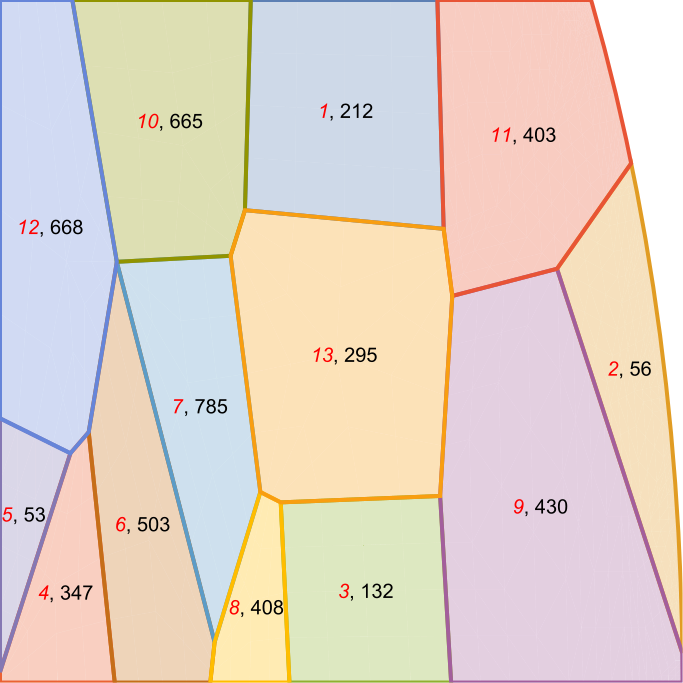

# Другие задачи линейного программирования

Определим функцию для построения замкнутой области на графике используя
библиотеку **plotly**.

```{r echo=FALSE, message=FALSE}
library(plotly)

add_region <- function(fig, xy, name = "region", color) {
  add_trace(
    fig,
    x = xy[, 1],
    y = xy[, 2],
    type = "scatter",
    fill = "toself",
    fillcolor = color,
    hoveron = "points+fills",
    marker = list(color = "red"),
    line = list(color = color),
    text = apply(xy, 1, paste, collapse = ","),
    hoverinfo = "text",
    name = TeX(name)
  )
}
```

## Целочисленная

Рассмотрим следующую задачу оптимизации в которой наглядоно показано
отличие целочисленного решения и округления решения в действительных
числах.

$$\begin{cases}
      \max{F(x,y)=y}\\
      -x+y\leq1\\
      3x+2y\leq12\\
      2x+3y\leq12\\
      x,y\geq0\\
      x,y\in\mathbb{Z}
\end{cases}\,$$ Для этого зададим все условия

```{r message=FALSE}
library(lpSolve)
Fun <- c(0, 1)
A <- rbind(c(-1, 1), c(3, 2), c(2, 3))
B <- c(1, 12, 12)
CD <- c("<=", "<=", "<=")
```

Теперь рассмотрим решение в действительных числах

```{r}
optimum <- lp(
  direction = "max",
  objective.in = Fun,
  const.mat = A,
  const.dir = CD,
  const.rhs = B
)
optimum
optimum$solution
```

Округляя до ближайшего целого получаем что точка (1.8,2.8) выходит из
области определения

```{r message=FALSE}
optimum <- lp(
  direction = "max",
  objective.in = Fun,
  const.mat = A,
  const.dir = CD,
  const.rhs = B,
  all.int = TRUE
)
optimum
optimum$solution
```

```{r echo=FALSE, message=FALSE}
library(plotly)
plot_ly(mode = "lines+markers") |>
  add_region(
    xy = rbind(c(0, 0), c(0, 1), c(6, 7), c(6, 0)),
    name = "-x+y\\leq1",
    color = "rgba(255, 212, 96, 0.5)") |>
  add_region(
    xy = rbind(c(0, 0), c(6, 0), c(0, 4)),
    name = "2x+3y\\leq12",
    color = "rgba(255, 212, 96, 0.5)") |>
  add_region(
    xy = rbind(c(0, 0), c(4, 0), c(0, 6)),
    name = "3x+2y\\leq12",
    color = "rgba(255, 212, 96, 0.5)") |>
  config(mathjax = "cdn")
```

```{r echo=FALSE}
x <- seq(0, 4, length.out = 4)
y <- seq(0, 3, length.out = 4)
z <- outer(x, y, FUN = \(x, y) {
  y
}) |> t()

plot_ly(x = x, y = y, z = z, type = "contour") |>
  add_region(
    xy = rbind(c(0, 0), c(0, 1), c(1.8, 2.8), c(12 / 5, 12 / 5), c(4, 0)),
    name = "-x+y\\leq1",
    color = "rgba(255, 212, 96, 0.5)") |>
  add_trace(
    x = c(0, 0, 1, 1, 1, 2, 2, 3, 3, 2, 4),
    y = c(0, 1, 0, 1, 2, 1, 2, 1, 0, 0, 0),
    type = "scatter",
    name = "допустимые решения",
    marker = list(color = "purple")) |>
  add_trace(
    x = c(1.8, 2),
    y = c(2.8, 3),
    type = "scatter",
    name = "решение в\nдействительных\nчислах",
    marker = list(color = "black")) |>
  config(mathjax = "cdn")
```

## Бинарная

Телекоммуникационная компания хочет установить радиовышки в новом
регионе, который состоит из 13 областей. Области и число жителей
показано на рисунке. Мощности устанавливаемого передатчика хватает,
чтобы обслуживать область, в которой он установлен и граничащие с ней.



Задача 1: Разместить наменьшее число передатчиков так, чтобы компания
мог оказывать услуги во всём регионе.

Задача 2: Имеется возможность установить один передатчик, установить его
так, чтобы число клиентов было максимальным.

### Решение

Передатчик в области может либо быть, либо отсутствовать. Это приводит к
применению бинарных переменных. Для начала требуется сформировать
условие присутствия в соседних областях. Т.е. передатчик должен быть
установлен или в самой области, или в граничащих с ним. Так для области
1 условие формулируется так: $$x_1+x_{11}+x_{10}+x_{13}\geq1$$.
Очевидно, что целевая функция выглядит следующим образом
$$\min{\Sigma x_i}$$.

Тогда полная формализация задачи:

#### Задача 1

$$\begin{cases}
      \min{F(x)=x_1+x_2+x_3+x_4+x_5+x_6+x_7+x_8+x_9+x_{11}+x_{12}+x_{13}}\\
      x_1+x_{10}+x_{11}+x_{13}\geq1\\
      x_2+x_9+x_{11}\geq1\\
      x_3+x_8+x_9+x_{13}\geq1\\
      x_4+x_5+x_6+x_{12}\geq1\\
      x_5+x_4+x_{12}\geq1\\
      x_6+x_4+x_7+x_{12}\geq1\\
      x_7+x_6+x_8+x_{10}+x_{13}\geq1\\
      x_8+x_3+x_6+x_7+x_{13}\geq1\\
      x_9+x_2+x_3+x_{11}+x_{13}\geq1\\
      x_{10}+x_1+x_7+x_{12}+x_{13}\geq1\\
      x_{11}+x_1+x_2+x_9+x_{13}\geq1\\
      x_{12}+x_4+x_5+x_6+x_{10}\geq1\\
      x_{13}+x_1+x_3+x_7+x_8+x_9+x_{10}+x_{11}\geq1\\
      \forall{i}:x_i\in{0,1}
\end{cases}\,$$

Целевая фунцкия, виды неравенст и столбец значений неравенств легко
задаётся

```{r}
Fun <- rep(1, 13)
B <- rep(1, 13)
CD <- rep(">=", 13)
```

Вспомогательная функция для задания матрицы ограничений. Так как матрица
достаточно разреженная она только устанавливает в 1 те индексы, которые
переданны в аргументе.

```{r}
constr_row <- function(...) {
  tmp <- rep(0, 13)
  tmp[c(...)] <- 1
  return(tmp)
}
```

Матрица ограничений задаётся вспомогательной функцией

```{r}
A <- rbind(
  constr_row(1, 10, 11, 13),
  constr_row(2, 9, 11),
  constr_row(3, 8, 9, 13),
  constr_row(4, 5, 6, 12),
  constr_row(5, 4, 12),
  constr_row(6, 4, 7, 12),
  constr_row(7, 6, 8, 10, 13),
  constr_row(8, 3, 6, 7, 13),
  constr_row(9, 2, 3, 11, 13),
  constr_row(10, 1, 7, 12, 13),
  constr_row(11, 1, 2, 9, 13),
  constr_row(12, 4, 5, 6, 10),
  constr_row(13, 1, 3, 7, 8, 9, 10, 11)
)
```

Введём эти значения используя lpSolve

```{r}
optimum <- lp(
  direction = "min",
  objective.in = Fun,
  const.mat = A,
  const.dir = CD,
  const.rhs = B,
  all.bin = TRUE
)
optimum
optimum$solution
```

Филиалы необходимо открыть в следующих регионах

```{r}
which(optimum$solution == 1)
```

#### Задача 2

В данном случае введём дополнительно набор переменных $y$, которые будут
означать то, что передатчик в отсутствует в текущей области и граничащих
с ней. Минимизация целевой функции построенной на $y$, говорит о том,
что надо выбрать как можно меньше областей с отсутствующей связью.

$$\begin{cases}
      \min{F(x)=212y_1+56y_2+132y_3+347y_4+53y_5+503y_6+785y_7+408y_8+430y_9+665y_{10}+403y_{11}+668y_{12}+295y_{13}}\\
      x_1+x_{10}+x_{11}+x_{13}+y_1\geq1\\
      x_2+x_9+x_{11}+y_2\geq1\\
      x_3+x_8+x_9+x_{13}+y_3\geq1\\
      x_4+x_5+x_6+x_{12}+y_4\geq1\\
      x_5+x_4+x_{12}+y_5\geq1\\
      x_6+x_4+x_7+x_{12}+y_6\geq1\\
      x_7+x_6+x_8+x_{10}+x_{13}+y_7\geq1\\
      x_8+x_6+x_7+x_3+x_{13}+y_8\geq1\\
      x_9+x_2+x_3+x_{11}+x_{13}+y_9\geq1\\
      x_{10}+x_1+x_7+x_{12}+x_{13}+y_{10}\geq1\\
      x_{11}+x_1+x_2+x_9+x_{13}+y_{11}\geq1\\
      x_{12}+x_4+x_5+x_6+x_{10}+y_{12}\geq1\\
      x_{13}+x_1+x_3+x_7+x_8+x_9+x_{10}+x_{11}+y_{13}\geq1\\
      x_1+x_2+x_3+x_4+x_5+x_6+x_7+x_8+x_9+x_{10}+x_{11}+x_{12}+x_{13}=1\\
      \forall{i}:x_i,y_i\in \{0,1\}
\end{cases}\,$$

Особенность задачи в том, что ограничения по x и y будут заданы
раздельно

```{r}
Fun <- c(rep(0, 13), c(212,56,132,347,53,503,785,408,430,665,403,668,295))
B <- rep(1, 14)
CD <- c(rep(">=", 13), "=")
```

Как и в прошлом пунке ограничения на $x$ задаются с помощью функции,
которая выставляет единицы в позиции использованных $x$.

```{r}
A <- rbind(
  constr_row(1, 10, 11, 13),
  constr_row(2, 9, 11),
  constr_row(3, 8, 9, 13),
  constr_row(4, 5, 6, 12),
  constr_row(5, 4, 12),
  constr_row(6, 4, 7, 12),
  constr_row(7, 6, 8, 10, 13),
  constr_row(8, 3, 6, 7, 13),
  constr_row(9, 2, 3, 11, 13),
  constr_row(10, 1, 7, 12, 13),
  constr_row(11, 1, 2, 9, 13),
  constr_row(12, 4, 5, 6, 10),
  constr_row(13, 1, 3, 7, 8, 9, 10, 11))
```

Матрица ограничений задаётся вспомогательной функцией. Ограничения для y
будет единичной матрицей

```{r}
A <- rbind(cbind(A, diag(13)), c(rep(1, 13), rep(0, 13))) 
```

Конструируем и решаем задачу используя **lpSolve**

```{r}
optimum <- lp(
  direction = "min",
  objective.in = Fun,
  const.mat = A,
  const.dir = CD,
  const.rhs = B,
  all.bin = TRUE
)
optimum
```

Вывод: если можно открыть только один филиал, то его надо открыть в
регионе:

```{r}
which(optimum$solution == 1)[1]
```

```{r}
optimum$solution
```

ifelse

g \<\<- sample_gnp(vtx_count, ifelse(simple,0.3,0.06))
if(is_connected(g))

edg_count \<- length(E(g))

v \<- farthest_vertices(g)\$vertices v vtx_from \<- v[1] vtx_to \<- v[2]

plot(g, layout=layout.circle, edge.label = E(g)\$weight)

Графовая библиотека Описание дополнительных функций, сокращенная лямбда

paths_vtx \<- all_simple_paths(g,vtx_from,vtx_to) path_count \<-
length(paths_vtx) path_count

Fun \<- sapply(paths_vtx, simplify = TRUE, FUN=sum) if (path_count \<
10) Fun

vtx_constr \<- mapply

()

as_adjacency_matrix

lapply

The code below generates an undirected graph with three edges. The
numbers are interpreted as vertex IDs, so the edges are 1--\>2, 2--\>3,
3--\>1.

g1 \<- graph( edges=c(1,2, 2,3, 3, 1), n=3, directed=F )

plot(g1) \# A simple plot of the network - we'll talk more about plots
later

class(g1) \## [1] "igraph" g1 \## IGRAPH U--- 3 3 --

## + edges:

## [1] 1--2 2--3 1--3

# Now with 10 vertices, and directed by default:

g2 \<- graph( edges=c(1,2, 2,3, 3, 1), n=10 )

plot(g2)

g3 \<- graph( c("John", "Jim", "Jim", "Jill", "Jill", "John")) \# named
vertices

# When the edge list has vertex names, the number of nodes is not needed

plot(g3)

g3 \## IGRAPH DN-- 3 3 --

## + attr: name (v/c)

## + edges (vertex names):

## [1] John-\>Jim Jim -\>Jill Jill-\>John

g4 \<- graph( c("John", "Jim", "Jim", "Jack", "Jim", "Jack", "John",
"John"),

```         
         isolates=c("Jesse", "Janis", "Jennifer", "Justin") )  
```

# In named graphs we can specify isolates by providing a list of their names.

plot(g4, edge.arrow.size=.5, vertex.color="gold", vertex.size=15,

```         
 vertex.frame.color="gray", vertex.label.color="black", 

 vertex.label.cex=0.8, vertex.label.dist=2, edge.curved=0.2) 
```

```{r}

```

<https://kateto.net/netscix2016.html>
