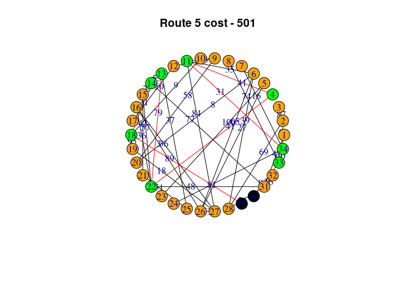
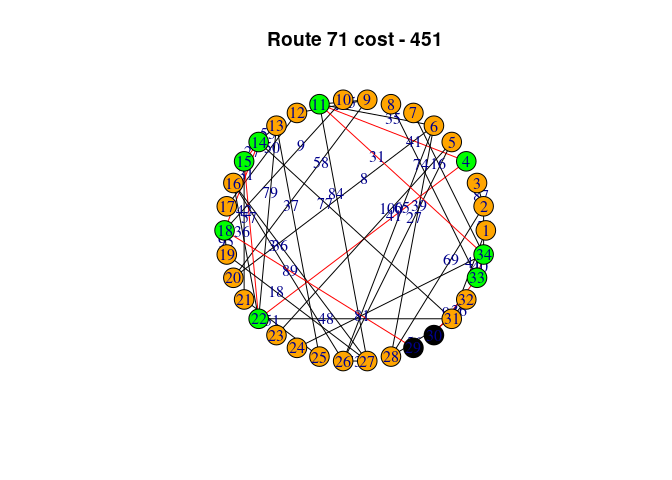
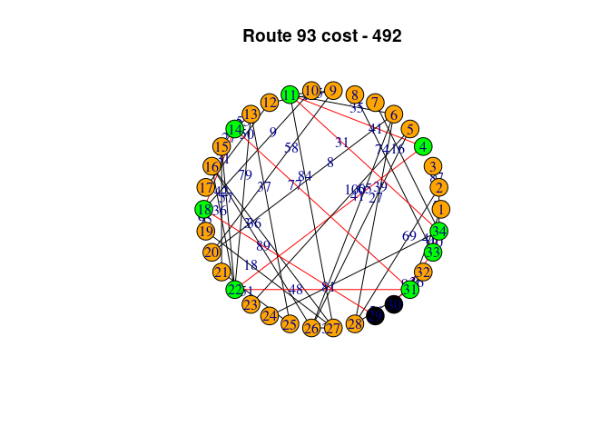
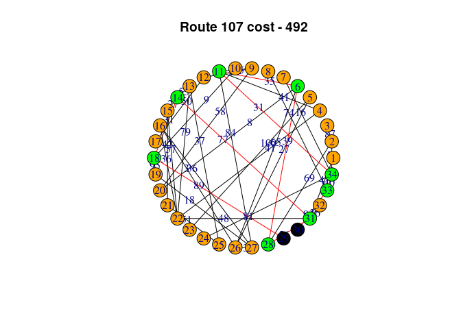
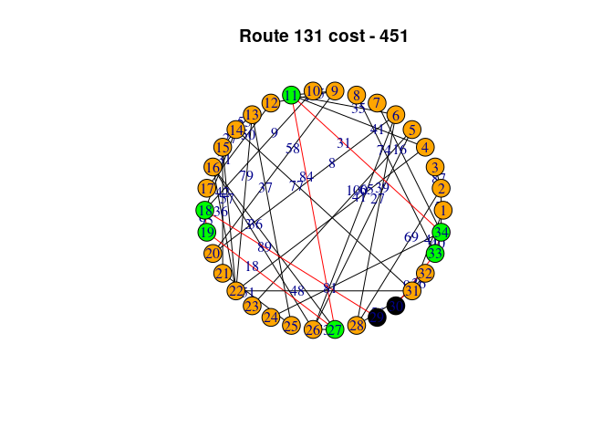

# Задача

Рассмотрим телекоммуникационную сеть, состоящую из $p$ узлов-маршрутизаторов $R$ и $q$ соединяющих их линий связи $P$.
Каждая линия связи оценивается временем задержки сигнала измеряемым в миллисекундах: $$W=\{w_1,w_2,...,w_q\}$$ Маршрутизаторы, имеют горячее резервирование кратности: $$SR=\{sr_1,sr_2,...,sr_p\}\\ 1\leq sr_i\leq 5$$ Линии связи имеют дублирование кратности: $$SP=\{sp_1,sp_2,...,sp_q\}\\ 1\leq sp_i\leq 5$$ Для высококритичных приложений, например, для военной техники, обязателен резерв канала боевого управления, а скорость передачи данных оказывает существенное влияние на отклик системы в целом.
Требуется найти два (в общем случае можно рассматривать $r$) зарезервированных канала от узла $k$ к узлу $l$, не задействующих совместно незадублированные маршрутизаторы и линии связи, обеспечивающих суммарно минимальное время задержки.

# Указания к решению.

1.  Найти все $N$ не образующие петель маршруты $Rt$ от узла $k$ к узлу $l$.
    Это можно сделать вручную.
    На высокую оценку необходимо разработать и реализовать алгоритм, осуществляющий построение таких маршрутов.
    Допускается использование библиотечной функции.

2.  Занумеруем все возможные маршруты от $1$ до $n$ и сопоставим каждому из них соответствующее время задержки $t_i$, равное сумме времен по всем ребрам маршрута $i$.

3.  Введем в качестве варьируемых параметров бинарные переменные $x_i$, $i=1,...,n$.
    Здесь $x_i=1$, если маршрут номер $i$ выбран и $x_i=0$, если нет.
    Тогда целевая функция, которую необходимо минимизировать, будет иметь вид: $$F(\vec{x})=\sum_{i=1}^{N}t_ix_i\\$$ Так как необходимо найти $r$ независимых каналов, первое ограничение имеет вид (в простейшем случае для двукратного резервирования $r=2$): $$\sum_{i=1}^{N}x_i=r$$

4.  Далее требуется построить ограничение ресурсов для маршрутов.
    Столбцами матрыцы ограничений будут маршруты, а по строкам задействованные маршрутизаторы и линии связи.
    Следовательно, для всех маршрутов использующих совместно маршрутизатор (линию связи) можно записать ограничение: $$\sum_{i\in V(Rt)} x_i \leq SR\\ \sum_{i\in E(Rt)} x_i \leq SP$$

    В теории графов для графа $g$ множество его вершин обозначается как $V(g)$, а множество его рёбер $E(g)$.

5.  Решаем задачу линейного целочисленного программирования.

6.  Построить граф с выделенными найденными маршрутами.

# Варианты

Введите ваше ФИО в параметр функции **digest2int**


```r
# install.packages('extraDistr')

library(digest)
library(extraDistr)
library(lpSolve)
library(igraph)

set.seed(digest2int('Сиколенко Михаил Александрович'))
```

Переменная *simple* отвечает за выбор варианта сложности.


```r
simple <- F
```

Далее на основании вашего ФИО и варианта сложности генерируются основные параметры задачи.
Число маршрутизаторов $p$:


```r
p <- ifelse(simple, rdunif(1,6,10), rdunif(1,10,34))
p
```

```
## [1] 34
```

Число резервных маршрутов $r$


```r
r <- ifelse(simple,2,rdunif(1,3,5))
r
```

```
## [1] 5
```

Граф маршрутизации


```r
repeat {
g <<- sample_gnp(p, ifelse(simple,0.2,0.05))
if(is_connected(g))
  break
}
```

Количество линий связи $q$


```r
q <- length(E(g))
q
```

```
## [1] 43
```

Задержка линии связи $W$


```r
E(g)$weight <- rdunif(q,1,100)
```

Резервирование маршрутизаторов $SR$


```r
V(g)$standby <- if(simple) rep(2,p) else rdunif(p,r,5)
```

Резервирование линий связи $SP$


```r
E(g)$standby <- if(simple) rep(2,q) else rdunif(q,r,5)
```

Узлы, между которыми требуется обеспечить надежную связь


```r
v <- farthest_vertices(g)$vertices
v
```

```
## + 2/34 vertices, from c6cbf93:
## [1] 29 30
```

```r
k <- v[1]
l <- v[2]
```

# Ваш вариант


Общая формулировка задачи выглядит следующим образом **(подстановка реализуется при сохранении, например html)**:

Рассмотрим телекоммуникационную сеть, состоящую из $p=34$ узлов-маршрутизаторов $R$ и $q=43$ соединяющих их линий связи $P$.
Сеть определяется граформ, заданным списком смежности: $$
\newcommand\ue{\mathrel{\bullet\mkern-3mu{-}\mkern-3mu\bullet}}
\{2\ue3,4\ue11,6\ue11,9\ue11,9\ue12,13\ue14,14\ue15,12\ue17,10\ue18,14\ue18,18\ue19,6\ue20,9\ue20,\\15\ue21,4\ue22,13\ue22,15\ue22,16\ue22,5\ue23,13\ue25,21\ue25,5\ue26,6\ue26,16\ue26,11\ue27,16\ue27,\\19\ue27,26\ue27,2\ue28,6\ue28,18\ue29,1\ue31,14\ue31,22\ue31,28\ue31,31\ue32,8\ue33,30\ue33,2\ue34,\\7\ue34,11\ue34,24\ue34,33\ue34\}
$$ Каждая линия связи оценивается временем задержки сигнала измеряемым в миллисекундах: $$W=\{87,41,35,65,14,55,27,50,9,31,95,8,58,42,41,79,57,36,100,37,51,27,65,3,84,36,18,73,69,39,89,41,77,48,\\56,36,74,94,55,16,31,81,40\}$$ Маршрутизаторы, имеют горячее резервирование кратности: $$SR=\{5,5,5,5,5,5,5,5,5,5,5,5,5,5,5,5,5,5,5,5,5,5,5,5,5,5,5,5,5,5,5,5,5,5\}$$ Линии связи имеют дублирование кратности: $$SP=\{5,5,5,5,5,5,5,5,5,5,5,5,5,5,5,5,5,5,5,5,5,5,5,5,5,5,5,5,5,5,5,5,5,5,5,5,5,5,5,5,5,5,5\}$$ Требуется найти $r=5$ зарезервированных канала от узла $k=29$ к узлу $l=30$, не задействующих совместно незадублированные маршрутизаторы и линии связи, обеспечивающих суммарно минимальное время задержки.

<!-- -->


```r
edge_list <- as_edgelist(g)
length(edge_list)
```

```
## [1] 86
```


```r
W <- E(g)$weight
length(W)
```

```
## [1] 43
```


```r
filter_loops <- function(paths) {
    filtered_paths <- lapply(paths, function(path) {
        if (!anyDuplicated(path)) {
            return(path)
        }
        return(NULL)
    })
    return(filtered_paths[!sapply(filtered_paths, is.null)])
}

find_non_loop_paths <- function(g, k, l) {
    all_paths <- all_simple_paths(g, from = k, to = l)
    non_loop_paths <- filter_loops(all_paths)
    return(non_loop_paths)
}
```


```r
non_loop_paths <- find_non_loop_paths(g, k, l)
length(non_loop_paths)
```

```
## [1] 203
```


```r
calculate_time_delay <- function(path, graph) {
    edge_indices <- t(combn(path, 2))
    edge_weights <- sapply(1:(nrow(edge_indices)), function(j) {
        edge <- get.edge.ids(graph, edge_indices[j, ])
        if (length(edge) > 0) {
            return(E(graph)$weight[edge])
        } else {
            return(0)
        }
    })
    return(sum(unlist(edge_weights)))
}
```


```r
time_delays <- sapply(non_loop_paths, calculate_time_delay, graph = g)
# time_delays
```


```r
# time_delays <- numeric(length(non_loop_paths))
# 
# for (i in seq_along(non_loop_paths)) {
#   path <- non_loop_paths[[i]]
#   edge_weights <- sapply(seq_along(path)[-1], function(j) {
#     edge <- get.edge.ids(g, c(path[j - 1], path[j]))
#     if (length(edge) > 0) {
#       return(E(g)$weight[edge])
#     } else {
#       return(0)
#     }
#   })
#   time_delay <- sum(edge_weights)
#   time_delays[i] <- time_delay
# }
# 
# time_delays
```


```r
N <- length(non_loop_paths)
Fun <- c(rep(0, p + q), c(time_delays))
A <- c(rep(0, p + q), rep(1, N))
B <- c(r)
```


```r
A
```

```
##   [1] 0 0 0 0 0 0 0 0 0 0 0 0 0 0 0 0 0 0 0 0 0 0 0 0 0 0 0 0 0 0 0 0 0 0 0 0 0
##  [38] 0 0 0 0 0 0 0 0 0 0 0 0 0 0 0 0 0 0 0 0 0 0 0 0 0 0 0 0 0 0 0 0 0 0 0 0 0
##  [75] 0 0 0 1 1 1 1 1 1 1 1 1 1 1 1 1 1 1 1 1 1 1 1 1 1 1 1 1 1 1 1 1 1 1 1 1 1
## [112] 1 1 1 1 1 1 1 1 1 1 1 1 1 1 1 1 1 1 1 1 1 1 1 1 1 1 1 1 1 1 1 1 1 1 1 1 1
## [149] 1 1 1 1 1 1 1 1 1 1 1 1 1 1 1 1 1 1 1 1 1 1 1 1 1 1 1 1 1 1 1 1 1 1 1 1 1
## [186] 1 1 1 1 1 1 1 1 1 1 1 1 1 1 1 1 1 1 1 1 1 1 1 1 1 1 1 1 1 1 1 1 1 1 1 1 1
## [223] 1 1 1 1 1 1 1 1 1 1 1 1 1 1 1 1 1 1 1 1 1 1 1 1 1 1 1 1 1 1 1 1 1 1 1 1 1
## [260] 1 1 1 1 1 1 1 1 1 1 1 1 1 1 1 1 1 1 1 1 1
```


```r
n_size <- p + q + N

constr_row <- function(...) {
    tmp <- rep(0, n_size)
    tmp[c(...)] <- 1
    return(tmp)
}
```


```r
limitation_id <- 2

for (i in 1 : length(non_loop_paths)){
    A <- rbind(A, constr_row(non_loop_paths[[i]]))
    A[limitation_id, p + q + i] <- 1
    limitation_id <- limitation_id + 1
    B <- c(B, V(g)$standby[1])
    edge_list <- c()
    for(j in 1 : length(non_loop_paths[[i]]) - 1){
        if(j == length(non_loop_paths[[i]]) - 1){
            break
        }
        vertex1 <- non_loop_paths[[i]][j + 1]
        vertex2 <- non_loop_paths[[i]][j + 2]
        edge <- get.edge.ids(g, c(vertex1, vertex2))
        edge_list <- c(edge_list, edge)
    }
    A <- rbind(A, constr_row(edge_list + p))
    A[limitation_id, p + q + i] <- 1
    limitation_id <- limitation_id + 1
    B <- c(B, E(g)$standby[1])
}
# A
```


```r
CD <- c("=", rep("<=", nrow(A) - 1))
CD
```

```
##   [1] "="  "<=" "<=" "<=" "<=" "<=" "<=" "<=" "<=" "<=" "<=" "<=" "<=" "<=" "<="
##  [16] "<=" "<=" "<=" "<=" "<=" "<=" "<=" "<=" "<=" "<=" "<=" "<=" "<=" "<=" "<="
##  [31] "<=" "<=" "<=" "<=" "<=" "<=" "<=" "<=" "<=" "<=" "<=" "<=" "<=" "<=" "<="
##  [46] "<=" "<=" "<=" "<=" "<=" "<=" "<=" "<=" "<=" "<=" "<=" "<=" "<=" "<=" "<="
##  [61] "<=" "<=" "<=" "<=" "<=" "<=" "<=" "<=" "<=" "<=" "<=" "<=" "<=" "<=" "<="
##  [76] "<=" "<=" "<=" "<=" "<=" "<=" "<=" "<=" "<=" "<=" "<=" "<=" "<=" "<=" "<="
##  [91] "<=" "<=" "<=" "<=" "<=" "<=" "<=" "<=" "<=" "<=" "<=" "<=" "<=" "<=" "<="
## [106] "<=" "<=" "<=" "<=" "<=" "<=" "<=" "<=" "<=" "<=" "<=" "<=" "<=" "<=" "<="
## [121] "<=" "<=" "<=" "<=" "<=" "<=" "<=" "<=" "<=" "<=" "<=" "<=" "<=" "<=" "<="
## [136] "<=" "<=" "<=" "<=" "<=" "<=" "<=" "<=" "<=" "<=" "<=" "<=" "<=" "<=" "<="
## [151] "<=" "<=" "<=" "<=" "<=" "<=" "<=" "<=" "<=" "<=" "<=" "<=" "<=" "<=" "<="
## [166] "<=" "<=" "<=" "<=" "<=" "<=" "<=" "<=" "<=" "<=" "<=" "<=" "<=" "<=" "<="
## [181] "<=" "<=" "<=" "<=" "<=" "<=" "<=" "<=" "<=" "<=" "<=" "<=" "<=" "<=" "<="
## [196] "<=" "<=" "<=" "<=" "<=" "<=" "<=" "<=" "<=" "<=" "<=" "<=" "<=" "<=" "<="
## [211] "<=" "<=" "<=" "<=" "<=" "<=" "<=" "<=" "<=" "<=" "<=" "<=" "<=" "<=" "<="
## [226] "<=" "<=" "<=" "<=" "<=" "<=" "<=" "<=" "<=" "<=" "<=" "<=" "<=" "<=" "<="
## [241] "<=" "<=" "<=" "<=" "<=" "<=" "<=" "<=" "<=" "<=" "<=" "<=" "<=" "<=" "<="
## [256] "<=" "<=" "<=" "<=" "<=" "<=" "<=" "<=" "<=" "<=" "<=" "<=" "<=" "<=" "<="
## [271] "<=" "<=" "<=" "<=" "<=" "<=" "<=" "<=" "<=" "<=" "<=" "<=" "<=" "<=" "<="
## [286] "<=" "<=" "<=" "<=" "<=" "<=" "<=" "<=" "<=" "<=" "<=" "<=" "<=" "<=" "<="
## [301] "<=" "<=" "<=" "<=" "<=" "<=" "<=" "<=" "<=" "<=" "<=" "<=" "<=" "<=" "<="
## [316] "<=" "<=" "<=" "<=" "<=" "<=" "<=" "<=" "<=" "<=" "<=" "<=" "<=" "<=" "<="
## [331] "<=" "<=" "<=" "<=" "<=" "<=" "<=" "<=" "<=" "<=" "<=" "<=" "<=" "<=" "<="
## [346] "<=" "<=" "<=" "<=" "<=" "<=" "<=" "<=" "<=" "<=" "<=" "<=" "<=" "<=" "<="
## [361] "<=" "<=" "<=" "<=" "<=" "<=" "<=" "<=" "<=" "<=" "<=" "<=" "<=" "<=" "<="
## [376] "<=" "<=" "<=" "<=" "<=" "<=" "<=" "<=" "<=" "<=" "<=" "<=" "<=" "<=" "<="
## [391] "<=" "<=" "<=" "<=" "<=" "<=" "<=" "<=" "<=" "<=" "<=" "<=" "<=" "<=" "<="
## [406] "<=" "<="
```


```r
optimum <- lp(
  direction = "min",
  objective.in = Fun,
  const.mat = A,
  const.dir = CD,
  const.rhs = B,
  all.bin = TRUE
)
optimum
```

```
## Success: the objective function is 2387
```

```r
optimum$solution
```

```
##   [1] 0 0 0 0 0 0 0 0 0 0 0 0 0 0 0 0 0 0 0 0 0 0 0 0 0 0 0 0 0 0 0 0 0 0 0 0 0
##  [38] 0 0 0 0 0 0 0 0 0 0 0 0 0 0 0 0 0 0 0 0 0 0 0 0 0 0 0 0 0 0 0 0 0 0 0 0 0
##  [75] 0 0 0 0 0 0 0 1 0 0 0 0 0 0 0 0 0 0 0 0 0 0 0 0 0 0 0 0 0 0 0 0 0 0 0 0 0
## [112] 0 0 0 0 0 0 0 0 0 0 0 0 0 0 0 0 0 0 0 0 0 0 0 0 0 0 0 0 0 0 0 0 0 0 0 0 1
## [149] 0 0 0 0 0 0 0 0 0 0 0 0 0 0 0 0 0 0 0 0 0 1 0 0 0 0 0 0 0 0 0 0 0 0 0 1 0
## [186] 0 0 0 0 0 0 0 0 0 0 0 0 0 0 0 0 0 0 0 0 0 0 1 0 0 0 0 0 0 0 0 0 0 0 0 0 0
## [223] 0 0 0 0 0 0 0 0 0 0 0 0 0 0 0 0 0 0 0 0 0 0 0 0 0 0 0 0 0 0 0 0 0 0 0 0 0
## [260] 0 0 0 0 0 0 0 0 0 0 0 0 0 0 0 0 0 0 0 0 0
```


```r
routes_id <- which(optimum$solution == 1) - p - q
routes_id
```

```
## [1]   5  71  93 107 131
```

```r
for(i in routes_id){
    cat(non_loop_paths[[i]])
    cat("\n")
}
```

```
## 29 18 14 13 22 4 11 34 33 30
## 29 18 14 15 22 4 11 34 33 30
## 29 18 14 31 22 4 11 34 33 30
## 29 18 14 31 28 6 11 34 33 30
## 29 18 19 27 11 34 33 30
```


```r
plot_graph_with_routes <- function(graph, selected_routes, special_nodes) {
    V(graph)$color <- "orange"
    V(graph)$color[special_nodes] <- "black"
    E(graph)$color <- "black"
    edge_list <- c()
    for (j in 1:(length(selected_routes[[1]]) - 1)) {
        vertex1 <- selected_routes[[1]][j]
        vertex2 <- selected_routes[[1]][j + 1]
        edge <- get.edge.ids(graph, c(vertex1, vertex2))
        edge_list <- c(edge_list, edge)
        intermediate_vertices <- selected_routes[[1]][-c(1, length(selected_routes[[1]]))]
        V(graph)$color[intermediate_vertices] <- "green"
    }
    E(graph)$color[edge_list] <- "red"
    plot(graph, layout = layout.circle, edge.label = E(graph)$weight)
}
```


```r
for (i in routes_id) {
    plot_graph_with_routes(g, list(non_loop_paths[[i]]), v)
    title <- paste("Route", i, "cost -", time_delays[i])
    title(main = title)
}
```

<!-- --><!-- --><!-- --><!-- --><!-- -->


# Оценивание

4-6 Поиск маршрутов вручную, задание ограничений вручную, простой вариант.

6-8 Автоматический поиск маршрутов, автоматическое или ручное задание ограничений, простой вариант.

8-10 Автоматическое решение общей задачи, отсутсвие явных циклов (используйте функции \*apply), продвинутая индексация.
